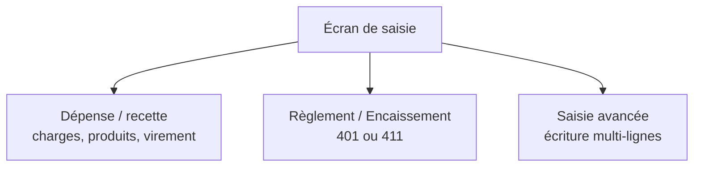
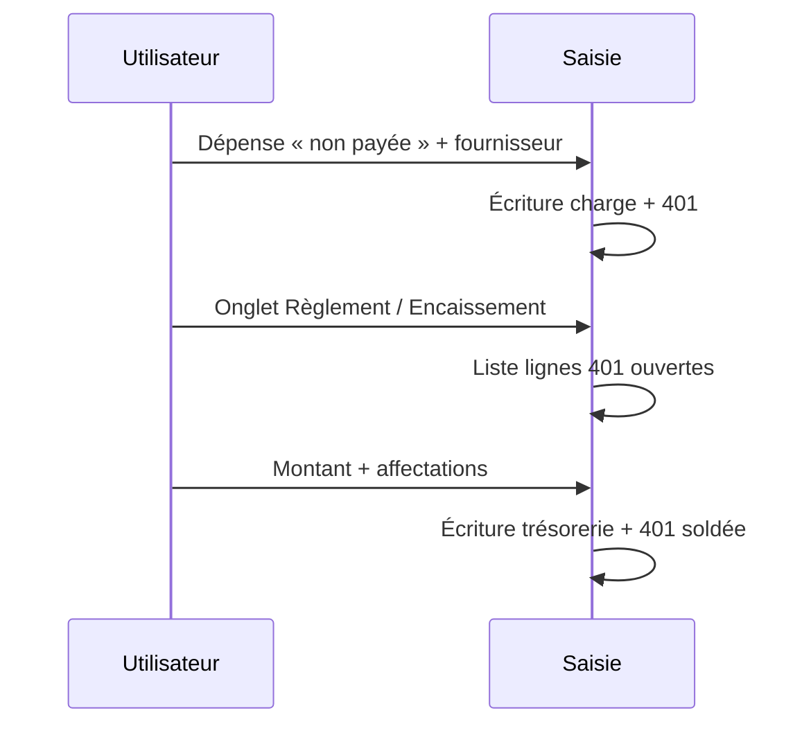

La **saisie comptable** enregistre vos opérations sous forme d’**écritures** (une ou plusieurs lignes débit / crédit équilibrées). L’écran est organisé en **trois modes**, accessibles par des boutons en tête de formulaire.

## Pré-requis

- Une **entité** est sélectionnée.
- Un **exercice** est disponible et **ouvert** (non clôturé).
- Pour la trésorerie : au moins un **compte classe 5** configuré dans la configuration de l’exercice.

La **date** d’écriture doit être **dans l’exercice** et **pas dans le futur** par rapport à aujourd’hui.

---

## Vue d’ensemble des trois modes

| Mode | Usage principal |
|------|-----------------|
| **Dépense / recette** | Saisie rapide : charges (6), produits (7), virement interne entre comptes 5 |
| **Règlement / Encaissement** | Paiement d’une dette fournisseur (401) ou encaissement d’une créance client (411), avec **affectation** sur les lignes ouvertes |
| **Saisie avancée (multiple)** | Écriture manuelle : journal au choix, N lignes, total débit = total crédit |

L’URL peut mémoriser l’onglet (`?tab=ops` ou `?tab=treasury`) pour revenir au même mode.

---

## Mode « Dépense / recette »

### Types d’opération

- **Dépense** : comptes de **charges** (classe **6**).
- **Recette** : comptes de **produits** (classe **7**).
- **Virement** : mouvement entre deux comptes de **trésorerie** (classe **5**), montant du débit sur le compte destination et crédit sur le compte source (journal **OD**).

### Montant et TVA (entité assujettie)

Si l’entité est **assujettie à la TVA**, pour une dépense ou une recette vous saisissez en général un **montant TTC** et un **taux de TVA**. L’application affiche une **prévisualisation HT / TVA** et génère les lignes correspondantes (charge ou produit, TVA déductible ou collectée, et trésorerie ou tiers — voir ci-dessous).

Si le taux est à **0 %** ou que l’entité **n’est pas** assujettie, la saisie se fait en **montant** simple (sans ventilation TVA automatique).

### « Facture déjà payée ? » (dépense et recette uniquement)

Ce choix détermine si la contrepartie immédiate est la **trésorerie** ou un **compte tiers** :

| Réponse | Dépense | Recette |
|---------|---------|---------|
| **Oui** (payé) | Charge débitée, **banque/caisse** créditée (journal **AC**) | **Banque/caisse** débitée, produit crédité (journal **VE**) |
| **Non** (dette / créance) | Charge débitée, **401 Fournisseurs** crédité ; le paiement se fera via **Règlement fournisseur** | **411 Clients** débité, produit crédité ; l’encaissement via **Encaissement client** |

Le journal de banque (**BQ**) ou caisse (**CA**) est choisi automatiquement selon que le compte de paiement commence par **53** (caisse) ou non.

:::tip
Pour une dépense ou recette **non payée**, vous devez sélectionner un **fournisseur** ou un **client** (vous pouvez en créer un à la volée). Le libellé d’écriture peut être enrichi automatiquement avec le nom du tiers.
:::

### Pièces justificatives (mode rapide)

Vous pouvez attacher un ou plusieurs fichiers PDF / images. Ils sont rattachés à la **ligne principale** de l’opération (charge, produit, ou ligne 401 selon le flux).

---

## Mode « Règlement / Encaissement »

Ce mode sert à **solder** une dette fournisseur ou à **encaisser** une créance client **sans** repasser par la charge ou le produit : uniquement **trésorerie** contre **401** ou **411**.

1. Choisissez **Règlement fournisseur** ou **Encaissement client**.
2. Sélectionnez le **tiers** et le **compte de trésorerie**.
3. Indiquez le **montant** du mouvement.
4. Le tableau liste les **lignes ouvertes** (401 en crédit pour le fournisseur, 411 en débit pour le client) avec le **reste** à solder. **Affectez** le montant sur une ou plusieurs lignes ; la **somme des affectations doit égaler exactement** le montant du règlement ou de l’encaissement.

L’enregistrement utilise un mécanisme d’**affectations** : chaque partie du paiement est liée aux lignes d’écriture d’origine, ce qui permet un suivi correct des soldes par facture / pièce.

:::note
Contrairement au mode rapide, ce mode utilise le bouton d’enregistrement dédié à l’onglet **Règlement / Encaissement** (pas le bouton générique du formulaire principal).
:::

### Cas d’usage typique

1. **Facture non payée** enregistrée en mode Dépense / recette (401 ou 411).
2. Plus tard, passage par **Règlement / Encaissement** pour pointer le virement ou l’encaissement réel sur les lignes concernées.

---

## Mode « Saisie avancée (multiple) »

Pour les opérations qui ne rentrent pas dans les assistants (OD diverses, régularisations, écritures complexes) :

1. Choisissez le **journal** (liste des journaux standards : BQ, CA, AC, VE, OD, etc.).
2. Saisissez **au moins deux lignes** avec des comptes du plan de l’exercice.
3. Pour chaque ligne, renseignez **débit** ou **crédit** (une ligne ne porte en principe qu’un seul côté à la fois).
4. Le **total débit** doit égaler le **total crédit** (à 0,01 € près côté interface).

Vous pouvez ajouter ou retirer des lignes, et joindre des **justificatifs** en bout de formulaire (pièces au niveau de l’écriture).

Si aucun journal n’est implicite, le système peut par défaut utiliser les **Opérations diverses (OD)** selon le contexte — en saisie avancée, c’est **vous** qui sélectionnez explicitement le journal.

---

## Règles transverses

- **Écriture équilibrée** : toute écriture respecte Débit = Crédit.
- **Exercice modifiable** : les écritures sont refusées si l’exercice est clos ou si l’association est fermée (garde-fous métier).
- **Tiers** : les opérations sur 401 / 411 sont reliées à un **fournisseur** ou **client** enregistré lorsque le flux le exige, pour l’audit et les états.

## Bonnes pratiques

- Enchaînez **facture (non payée)** puis **règlement / encaissement** plutôt que de tout passer en payé si la réalité est une dette ou une créance.
- Utilisez la **saisie avancée** pour les cas limites ; gardez le mode rapide pour le flux courant.
- Joignez les **justificatifs** dès la saisie pour sécuriser votre dossier.
